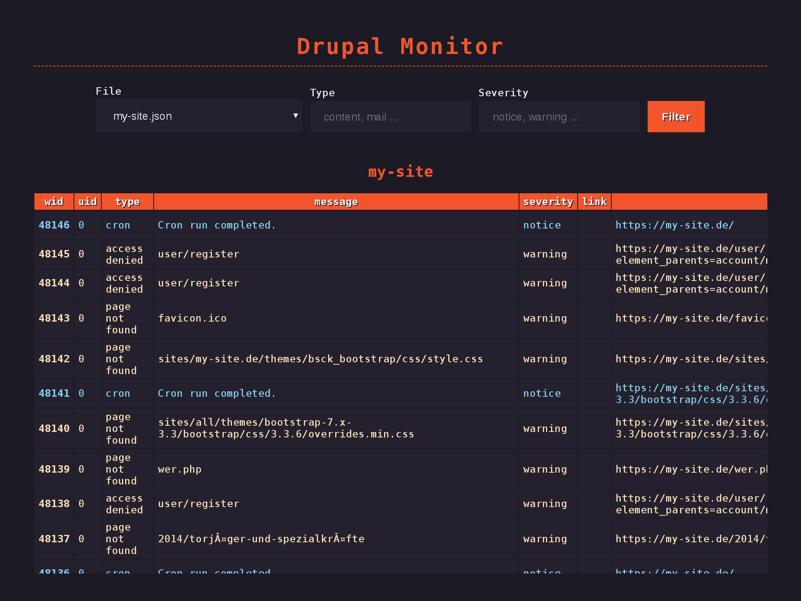

# Drupal watchdog monitor



### Installing

cd into the repository and

```
mkdir logs
```

then create your watchdog logs via drush

```
drush @my_website.live ws --format=json --count=1000 > logs/my_website.json
```
